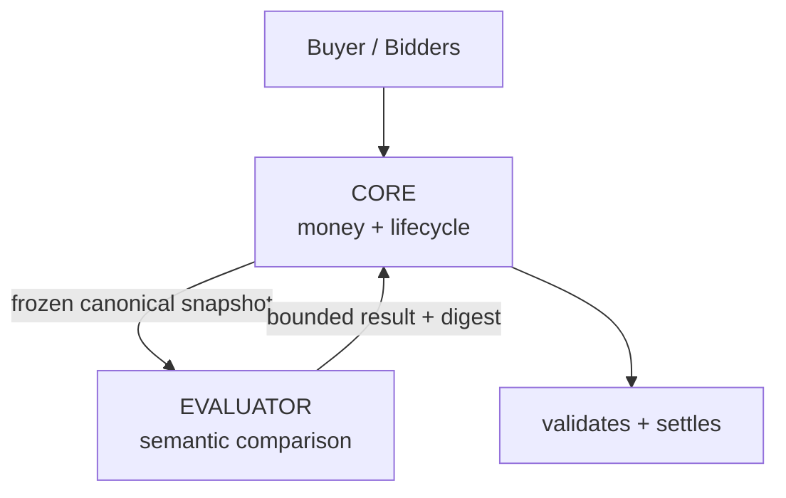

# TenderCouncil reviewer guide

## The problem

Procurement has two different kinds of truth. Money, identity, deadlines,
eligibility, and settlement must be exact and machine-checkable. The deciding
question, however, is often comparative natural-language judgment: among bids
that satisfy the mandatory rules, which proposal best meets the buyer's locked
requirements and rubric? Treating that question as a simple price sort loses
technical, delivery, capability, and support context. Leaving all of the money
flow to a model or centralized operator is equally unsuitable.

TenderCouncil separates those responsibilities. A bidder authenticates its
offer with a wallet. The bidder and buyer commit exact proposal and evidence
bytes. Core stores commercial facts and escrow. Only after the tender closes
does the bound Evaluator perform the bounded semantic comparison.

## Why GenLayer

The decision that cannot be encoded as deterministic arithmetic is the
comparative semantic evaluation of otherwise admissible bids against a locked
procurement rubric. A deterministic contract can compare prices, delivery
days, support days, hashes, IDs, and score arithmetic. It cannot itself decide
whether one valid technical approach is more persuasive or capable than
another from authenticated natural-language material.

GenLayer supplies validator-consensus execution around that narrow semantic
boundary. TenderCouncil does not ask validators to own funds or invent the
commercial envelope. It asks the Evaluator to return bounded criterion
judgments for a fixed candidate set; Core checks the returned partition,
scores, arithmetic, winner membership, and correlation before recording a
provisional award.

## Two-contract architecture

**Core owns money and lifecycle. Evaluator owns no funds and can only return a
bounded comparative judgment that Core independently correlates and validates.**



Core is `0x5ADbA50CE6c6fFBA738f212ba12fC3C78B2664cd`. The permanently bound
Evaluator is `0x023AB3434761715a531884Ca0852aC14beE03acE`, version
`tendercouncil.evaluator.v2.1`, on GenLayer Bradbury chain `4221`.

## Architecture in 30 seconds

The lifecycle has four phases:

1. **CREATE** — the buyer funds an exact escrow, opens the tender, and bidders
   submit authenticated offers.
2. **FREEZE** — after the deadline, Core closes the tender and forms a sorted,
   canonical `tendercouncil.snapshot.v1` with a stored digest.
3. **DECIDE** — Core requests evaluation; the Evaluator authenticates committed
   bytes, applies deterministic/integrity filters, compares semantic
   candidates, and returns a provisional award. A response window permits a
   bounded challenge/review branch.
4. **SETTLE** — after final award, Core derives the winner payout from the
   stored bid, confirms the finalized balance delta, emits any unused buyer
   refund, confirms the second delta, and reaches `SETTLED`.

The repository's canonical post-submission pilot attempt is documented in
[`docs/pilot/FINALIZED-BRADBURY-PROCUREMENT.md`](pilot/FINALIZED-BRADBURY-PROCUREMENT.md).
It currently records a blocked attempt rather than claiming a completed live
procurement: Bradbury finality consumed its one-hour bid deadline before the
first bid could be accepted. The historical parked E2E remains separate.

## Deterministic responsibilities

Core deterministically handles:

- exact escrow equal to `max_budget_wei` and global financial-outflow locks;
- unique tender, bid, and challenge IDs;
- sender-authenticated buyer, bidder, and challenger wallet roles;
- HTTPS URL, SHA-256, commitment grammar, schema, and rubric validation;
- deadline and response-window enforcement;
- immutable bid storage and one bid per wallet per tender;
- canonical close-snapshot formation sorted by `bid_id` and its digest;
- admissibility exclusions for over-budget, late, over-delivery, under-support,
  or unsupported-schema bids;
- evaluator result partition, score bounds, score arithmetic, complete
  coverage, unique top score, and winner identity validation;
- evaluation and review nonce correlation;
- challenge admission and challenge-set digest formation;
- final winner identity, payout recipient, payout amount, and refund amount;
- finalized-only transfers, observed balance deltas, settlement state, and
  prevention of duplicate concurrent outflows.

Core never fetches web content, calls an LLM, or accepts a free-form model
amount. It derives settlement values from the escrow and immutable winning bid.

## GenLayer responsibility

The deployed Evaluator's semantic responsibility is intentionally small. It
fetches the closed snapshot's committed proposal and evidence bytes, hashes
them before parsing, validates the v2.1 manifest/evidence schemas, and builds a
bounded semantic candidate set. The model-facing row is exactly:

```json
{
  "bid_id": "...",
  "mandatory_requirements_pass": true,
  "technical": 0,
  "delivery": 0,
  "price": 0,
  "capability": 0,
  "support": 0
}
```

The production rubric maxima are technical `35`, delivery `20`, price `20`,
capability `15`, and support `10`. The Evaluator derives classifications,
valid/disqualified sets, totals, winner, runner-up, and result envelope from
the normalized bounded rows. Its validator function compares decision-critical
identity and partition fields exactly and permits only the deployed small score
tolerance where the source allows it.

## Why Evaluator cannot steal funds

The Evaluator does not custody escrow and has no settlement authority. Core's
financial state is the source of truth. The Evaluator address, version, and
code hash are permanently bound in Core, and callbacks must come from that
bound address. A callback must match the current evaluation nonce and frozen
snapshot digest. Core loads the persisted Evaluator result, checks its digest
and schema, requires the winner to be an original valid bid in the frozen
snapshot, and independently validates score structure and ordering.

The model cannot name an arbitrary recipient or arbitrary payout. Core reads
the bidder wallet and quote from its own stored bid, then computes payout and
buyer remainder from the tender escrow. The only transfers are Core-controlled
finalized payout/refund operations.

## Async/callback safety

`start_evaluation` finality only starts an asynchronous Core-to-Evaluator job.
The job is correlated by tender ID, evaluation nonce, bound evaluator, and
closed-snapshot digest. The callback must be in the current evaluating state,
match that nonce and digest, and match the Evaluator's persisted result digest.

The challenge path adds a review nonce, original evaluation-result digest, and
challenge-set digest. Review can only uphold the original winner, replace it
with an original valid bid, or produce the bounded no-valid result. Timeout and
model failure are explicit bounded retryable states; the source limits the
number of attempts. A client must reconcile a transaction and current Core
state before retrying. RPC timeout, validator latency, or a dead poller is not
proof of failure.

## Financial safety

Core records escrow, winner payout, buyer remainder, transfer kind, amount,
and pre-transfer balance in settlement accounting. A global financial-outflow
lock serializes payout/refund transfers. `settle_award` enters a pending state;
`confirm_settlement` requires the exact observable balance delta before Core
marks payout confirmed and starts a remainder refund. `confirm_refund` requires
the second exact delta before clearing the lock and reaching `SETTLED`.

The invariant is:

`escrow_deposited = winner_payout_amount + buyer_refund_amount`

Historical Core balance is not itself a per-tender proof. Reviewers should use
`get_settlement_accounting(tender_id)` plus the before/after Core balance
observations for the specific tender.

## Reviewer invariant map

| Risk | Protection |
| --- | --- |
| stale evaluation callback | evaluation nonce + snapshot digest |
| wrong evaluator | permanent evaluator address/version/code-hash binding |
| changed bid set | canonical closed snapshot |
| arbitrary winner | winner must be a valid bid from the frozen snapshot |
| arbitrary payout | Core derives payout from stored winning bid |
| duplicate settlement | lifecycle state + financial outflow lock |
| stale challenge review | review nonce + original result + challenge-set digest |
| model/provider failure | bounded retry/failure states |
| async transfer uncertainty | balance-delta confirmation |

## Public API classification

**APPLICATION ENTRY POINTS** are the normal integration calls: `create_tender`,
`open_tender`, `submit_bid`, `close_tender`, `start_evaluation`,
`start_response_window`, `submit_challenge`, `advance_after_response`,
`settle_award`, `confirm_settlement`, and `confirm_refund`.

**PROTOCOL CALLBACKS** are cross-contract methods: Core's
`receive_evaluation_result`, `receive_evaluation_failure`,
`receive_review_result`, and `receive_review_failure`, plus the Evaluator's
Core-only `start_evaluation_job` and `start_review_job`.

**RECOVERY / TIMEOUT** includes `expire_evaluation_attempt`,
`retry_evaluation`, `expire_review_attempt`, `retry_review`,
`cancel_tender`, `refund_no_valid_bid`, `confirm_no_valid_refund`, and
`refund_failed_evaluation`.

**READ-ONLY INTEGRATION** includes readiness/binding and balance views,
`get_tender`, `get_bid`, `get_closed_snapshot`, `get_evaluation_context`,
`get_settlement_accounting`, `get_evaluation_result`, `get_review_context`,
`get_review_result`, and list/constructor readbacks. The complete signatures
remain in the README and integration guide.

## Proof matrix

| Claim | Status |
| --- | --- |
| Production Core deployed | YES |
| Production Evaluator deployed | YES |
| Permanent binding finalized | YES |
| `production_ready=true` | YES |
| Funded tender live | YES — pilot tender creation finalized |
| Two valid bids live | NO |
| Closed snapshot live | NO |
| Comparative evaluation finalized | NO |
| Precommitted winner comparison | HISTORICAL — expectation committed, no output |
| Provisional award live | NO |
| Response window live | NO |
| No-challenge final award live | NO |
| Winner settlement live | NO |
| Buyer remainder refund live | NO |
| `SETTLED` state live | NO |
| Challenge/review branch live | NO — tested locally only |
| Retry branches live | NO — tested locally only |
| Mainnet | NO |
| Third-party audit | NO |

## Tested but not live-proven

The challenge/review path and several retry/failure branches have repository
test evidence, but were not run in this pilot. The canonical live attempt did
not reach evaluation. No claim here upgrades local tests into live proof.

## Known limitations

Bradbury is a testnet with substantial and variable finality latency. The
semantic boundary remains fallible: models can misunderstand evidence, and
evidence quality/source availability is an operational assumption even when
bytes are hash-authenticated. The repository makes no mainnet claim and no
third-party audit certification claim.
